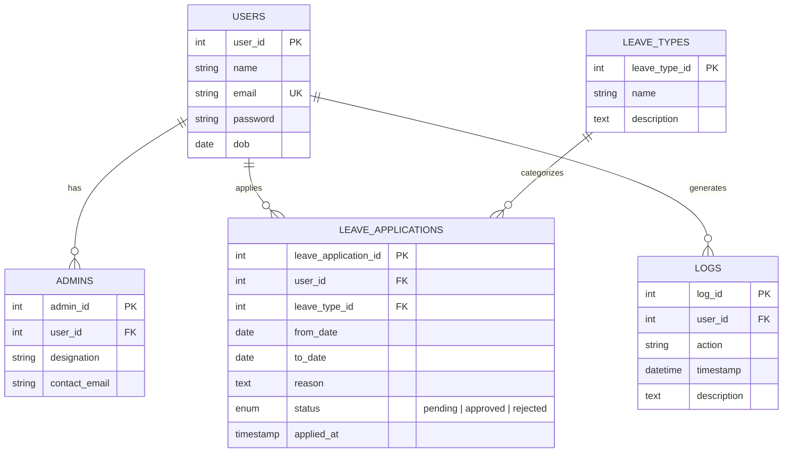

<div align="center">

# LeaveEase

### Modern Employee Leave Management & Audit System

[](https://nodejs.org/)
[](https://expressjs.com/)
[](https://www.mysql.com/)
[](https://www.docker.com/)
[](LICENSE)

An intuitive, role-based web application designed to streamline leave applications, approvals, and compliance tracking for modern organizations. Built with Node.js, Express, EJS, and MySQL, fully containerized with Docker.

[Features](#-key-features) • [Tech Stack](#-tech-stack) • [Quick Start](#-quick-start) • [Docker Deployment](#-docker-deployment) • [Database Architecture](#-database-architecture) • [Default Credentials](#-default-credentials)

</div>

---

## 📌 Project Overview

**LeaveEase** replaces paper-based and disjointed leave tracking mechanisms with an end-to-end, automated leave management workflow. It empowers employees to check leave balances, apply for time off with real-time validation, and monitor request statuses. For managers and administrators, LeaveEase provides a centralized dashboard to review, approve, or reject requests with real-time employee history and database-triggered audit logs.

### 🎯 Key Highlights
- **Role-Based Workflows**: Tailored portals and access controls for Employees and Administrators.
- **Real-Time Data Visualization**: Interactive Chart.js analytics for leave utilization, distributions, and pending approvals.
- **Database-Level Audit Logging**: Automated MySQL triggers capture create and update events directly in audit tables.
- **Production-Ready Containerization**: Complete multi-container Docker Compose setup with automated schema migrations, seed scripts, and health-checked service orchestration.

---

## ✨ Key Features

### 👤 Employee Portal
- **Interactive Dashboard**:
  - Metric summary cards (*Total Applied, Pending, Approved, Rejected*).
  - Visual analytics with Chart.js displaying leave trends and leave-type breakdown.
  - Upcoming leaves timeline and quick-access leave history table.
- **Leave Application Engine**:
  - Dynamic leave types queried from the database (*Casual, Sick, Earned, Emergency, Personal*).
  - Client-side duration calculator (automatically counts leave days between start and end dates).
  - Validation to prevent invalid date ranges and past-date submissions.
- **Leave Management**:
  - View full history of leave applications with live status indicators.
  - Edit or withdraw/cancel pending leave applications.
- **Profile & Account**:
  - Edit user profile details and securely update passwords.

### 🛡️ Administrator Portal
- **Admin Command Center**:
  - Organization-wide metrics and KPIs on staff absence and pending requests.
- **Leave Request Management**:
  - Tabbed interface to filter requests by status (*Pending, Approved, Rejected*).
  - Live instant search filter by employee name or reason.
  - Quick action buttons to **Approve** or **Reject** with one click.
  - Requester stats modal showing historical leave record before approving.
- **Automated Audit Logs**:
  - Real-time event log viewer displaying trigger-generated records (action, user ID, timestamp, description).
- **Admin Profile**:
  - Manage administrative designations and contact details.

### 🔒 Security & Architecture
- **Password Hashing**: Passwords encrypted with `bcrypt` (10 salt rounds).
- **Session Management**: Secure cookie-backed session handling via `express-session`.
- **RBAC Middleware**: Route protection using `isAuthenticated` and `isAdmin` middleware.
- **Environment Isolation**: Centralized `.env` configuration for credentials and database connections.

---

## 🛠️ Tech Stack

| Layer | Technology |
|---|---|
| **Runtime & Server** | [Node.js](https://nodejs.org/) (v20+), [Express.js](https://expressjs.com/) (v5) |
| **Database** | [MySQL 8.0](https://www.mysql.com/) with native connection pooling (`mysql2`) |
| **Frontend / View Engine** | [EJS](https://ejs.co/) (Embedded JavaScript), HTML5, CSS3, Vanilla JavaScript |
| **Visualizations** | [Chart.js](https://www.chartjs.org/) |
| **Authentication & Security** | `bcrypt`, `express-session`, `dotenv` |
| **DevOps & Containers** | Docker, Docker Compose, Alpine Linux |
| **Testing** | Jest, Supertest |

---

## 📁 Repository Structure

```plaintext
LeaveEase/
├── config/                  # Configuration files
├── controllers/             # Business logic controllers
├── db/
│   ├── schema.sql           # Database tables, relations, and MySQL triggers
│   └── seed.sql             # Default seed data (admin account & leave types)
├── middleware/              # Authentication and authorization guards
├── public/                  # Static assets (stylesheets, images, scripts)
│   ├── css/                 # UI styles (login, signup, dashboards)
│   └── images/              # Media and brand logos
├── routes/                  # Express route definitions
│   ├── auth.js              # Authentication endpoints
│   ├── calendar.js          # Calendar API endpoints
│   └── dashboard.js         # Employee & Admin dashboard routing
├── scripts/
│   └── seed.js              # Node.js automated database seed runner
├── test/
│   └── smoke.test.js        # Health check and smoke test suite
├── views/                   # EJS templates and web pages
│   ├── admin-dashboard.ejs  # Administrator dashboard view
│   ├── admin-leave-requests.ejs # Leave approval/rejection panel
│   ├── admin-logs.ejs       # System audit logs view
│   ├── employee-dashboard.ejs # Employee dashboard view
│   ├── leave-apply.ejs      # Leave request form view
│   └── ...                  # Other views & modals
├── app.js                   # Main application entry point & Express configuration
├── db.js                    # Database connection pool & auto-reconnect logic
├── DEVOPS.md                # DevOps and infrastructure documentation
├── Dockerfile               # Production multi-stage Alpine Docker container
├── docker-compose.yml       # Multi-container orchestration (App + MySQL)
├── package.json             # NPM dependencies and project scripts
└── README.md                # Project documentation
```

---

## 🚀 Quick Start

### Prerequisites
- [Node.js](https://nodejs.org/) (v18 or higher recommended)
- [MySQL Server](https://dev.mysql.com/downloads/installer/) (v8.0+)
- [Git](https://git-scm.com/)

### 1. Clone the Repository
```bash
git clone https://github.com/your-username/LeaveEase.git
cd LeaveEase
```

### 2. Install Dependencies
```bash
npm install
```

### 3. Configure Environment Variables
Copy `.env.example` to `.env` and fill in your credentials:
```bash
cp .env.example .env
```
Example configuration:
```env
PORT=3000
DB_HOST=localhost
DB_USER=root
DB_PASSWORD=your_mysql_password
DB_NAME=leaveease
DB_PORT=3306
SESSION_SECRET=your_super_secret_session_key
```

### 4. Setup Database
Create database and run migrations with seeds:
```bash
# Log into your MySQL CLI:
mysql -u root -p < db/schema.sql

# Seed default leave types and administrator:
npm run seed
# or: mysql -u root -p leaveease < db/seed.sql
```

### 5. Start Application
```bash
npm start
```
Access the application at: **`http://localhost:3000`**

---

## 🐳 Docker Deployment

LeaveEase is fully containerized. You can run the entire stack (Node.js App + MySQL 8.0 with persistent storage and automatic database migrations) with a single command:

```bash
docker compose up -d
```

### What happens under the hood:
1. Spawns a **MySQL 8.0** service with a persistent volume (`mysql_data`).
2. Automatically executes `db/schema.sql` and `db/seed.sql` on first boot via `/docker-entrypoint-initdb.d/`.
3. Performs a `mysqladmin ping` healthcheck to confirm DB readiness.
4. Builds the lightweight **Node.js 20 Alpine** container running under an unprivileged `node` user.
5. Bridges both containers on `leaveease-net` and exposes port `3000`.

### Stop Containers
```bash
docker compose down
```

---

## 🔑 Default Credentials

For testing and administrative evaluation, the database seed initializes the following default account:

| Role | Email | Password |
|---|---|---|
| **System Admin** | `admin@leaveease.com` | `admin123` |
| **New Employee** | Register via `/signup` | User defined |

---

## 📊 Database Architecture

The application uses an efficient relational schema structured as follows:



---

## 🧪 Testing

Execute the automated test suite using Jest:

```bash
npm test
```

---

## 🤝 Contributing

Contributions, issues, and feature requests are welcome!
1. Fork the Project
2. Create your Feature Branch (`git checkout -b feature/AmazingFeature`)
3. Commit your Changes (`git commit -m 'Add some AmazingFeature'`)
4. Push to the Branch (`git push origin feature/AmazingFeature`)
5. Open a Pull Request

---

## 📝 License

Distributed under the **ISC License**. See `LICENSE` for more information.
